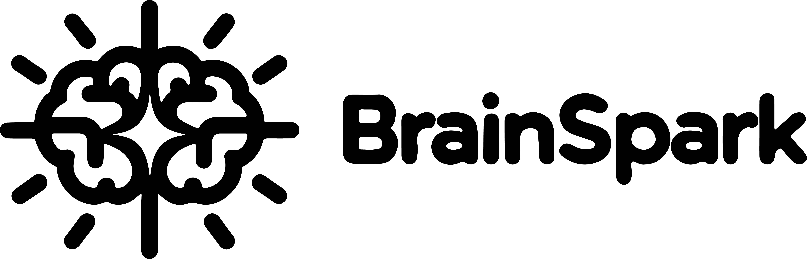
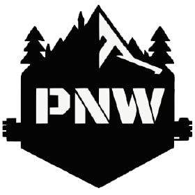

# BrainSpark

2024 Spring [HackPNW](https://hackpnw.org) Project

## Quiz. Play. Learn.

The one-stop study tool to unleash your potential, BrainSpark transforms learning into an exhilarating journey, where each quiz invites you into a world of discovery, guided by custom questions and powerups to ignite your curiosity.

## Installation

Requirements
* NodeJS (v14.4+)
* NPM (v10.2+)

**Clone the project**
 You can download it straight from GitHub or clone it using Git CLI. 

**Installing dependencies**
 There are two different NodeJS projects in this repo.

1. Open the backend directory
2. Run `npm install`
3. Open the frontend directory
4. Run `npm install`

## Usage

**In order to run the project, you must have:**
* An OpenAI Key - In order to generate the content for the game
* A [Redis Server](https://hub.docker.com/r/redislabs/redisearch) - To store the data & games

#### Backend

To run the backend you can run `nodemon .` or `node .` in the backend directory to start up the API server.

#### Frontend

To run the frontend you can run `npm run start` in the frontend directory

## Contributing

Pull requests are welcome. For major changes, please open an issue first
to discuss what you would like to change.

Please make sure to update tests as appropriate.

## License

[Apache 2.0](https://choosealicense.com/licenses/apache-2.0/)

Special Thanks To:
-------------

<table>
<tr>
<td>

### HackPNW

[HackPNW](https://www.hackpnw.org/) has successfully hosted two events so far with over 250 unique attendees leading the way as the pacific northwest's premier high school hackathon. We're expecting over 250 attendees this HackPNW Spring 2024! 

</td>
</tr>
</table>

